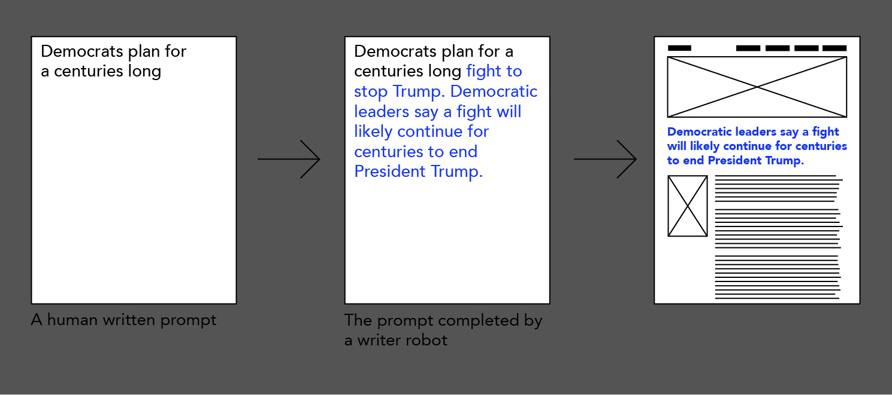

{{}}

This page is a collection of tools necessary for the upcoming Information Design workshop. I ask everyone to install the tools before the workshop so that we can focus on the methods rather than the installation. 

## 1. Register a Runway ML account in advance and send me a list of all the participants's registration emails.
[RunwayML](https://runwayml.com/) is a tool used for generation and transformation of visual and textual content powered by [machine learning.](https://www.technologyreview.com/2016/05/10/160287/algorithm-clones-van-goghs-artistic-style-and-pastes-it-onto-other-images-movies/) During this workshop we will train writer robots. The training requires premium features of RunwayML, these will be activated on everyone's runwayML account for the duration of the workshop(and for 2 days afterwards).

**For this I ask everyone to [create a free RunwayML account](https://runwayml.com/) in advance and send me a list with all the registration emails. Please send me the list by the lunch of friday(12. 2.) at matus.solcany@protonmail.com.**

## 2. Bring your own conspiratorial online text content
To train writer robots we will need some text content in the form of online news articles. I ask everyone to find and bring **english** far right, propaganda, conspiratorial or fake news websites to the workshop (for example: [Breitbart](https://www.breitbart.com/), [Infowars](https://www.infowars.com/))

## 3. Join Slack 
To share files, links and information we'll be using Slack. Please [join here](https://join.slack.com/t/thefutureofdi-5d99342/shared_invite/zt-m8bz9w0k-lTgvpM1McKuGWxSKUUHQ8A).

## 4. Install these tools 
### Code editor: Atom
[Atom](https://atom.io/) is an easy to use code editor. Feel free to use any other code editor.

### Terminal (No need to install, it's built in)
The web scraping tools that we'll be using during the workshop rely on the command line interface of [Terminal](https://en.wikipedia.org/wiki/Terminal_%28OS_X%29)(or its Windows and Linux variants). If you've attended the Reality Bricolage workshop you've experienced it. If you haven't please get the basic understanding from [this youtube video](https://www.youtube.com/watch?v=5XgBd6rjuDQ).(Excuse the intro music)

### Tools installer: Homebrew
[Homebrew](https://brew.sh/) is a tool used to install programming languages and command line tools. The people that have attended the Reality Bricolage workshop already have it. If you haven't attended install it by running the command below in your Terminal:

    /bin/bash -c "$(curl -fsSL https://raw.githubusercontent.com/Homebrew/install/HEAD/install.sh)"

### Web scraping: Python and Scrapy
[Scrapy](https://scrapy.org/) is a tool for scraping content from websites. It's made in [Python](https://www.python.org/). Once you have Homebrew installed, install Python and Scrapy via Terminal with these commands:

    brew install python
    
    # check if you have python 3
    python3 --version
    # Python 3.9.1, Success! (as long as it's 3.8 or more you're set)
    
    # Once Python is installed, install Scrapy
    brew install scrapy

### Web scraping security: Tor and Privoxy
Some websites protect themselves from scraping by banning IP addresses of scrapers. To avoid this problem we will hide our IP addresses with Tor and Privoxy. Install with:

    brew install tor
    brew install privoxy

## Trouble installing the tools?

If you're having trouble installing any of the tools feel free to reach out to me on the workshop [Slack channel](https://join.slack.com/t/thefutureofdi-5d99342/shared_invite/zt-m8bz9w0k-lTgvpM1McKuGWxSKUUHQ8A)

