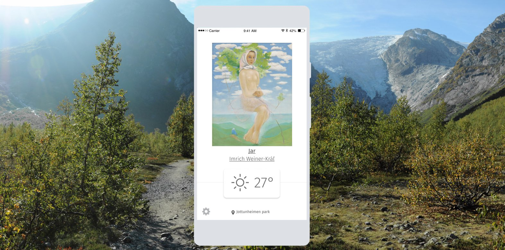
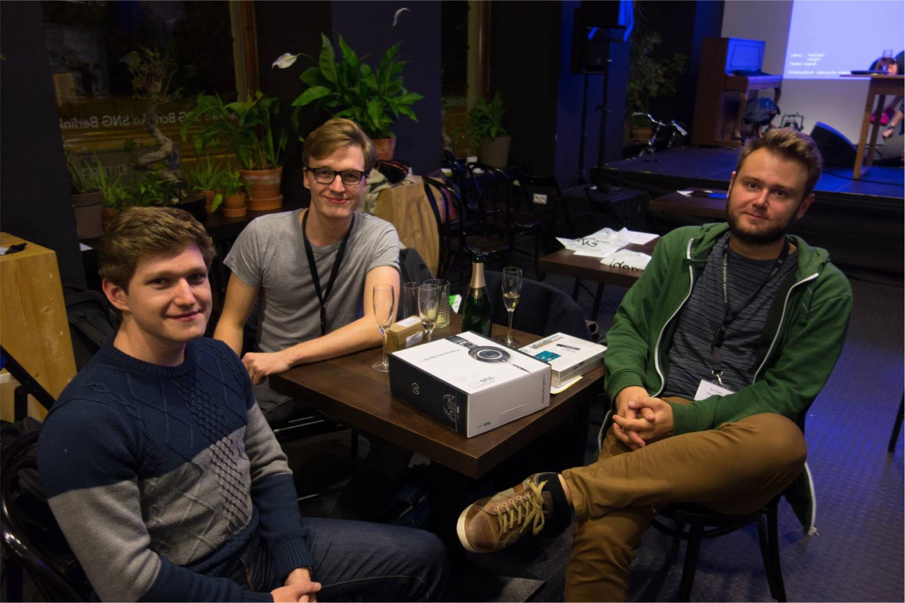

{{}}

## Klima is an app for discovery and curation of digitized art collections by matching artworks to the current weather of the user

After a match is found, the user is asked to vote weather the artwork fits their current weather experience. A positive vote reinforces the link of the artwork and the current weather. A negative vote gives the user an option to choose a better fitting weather for the artworks.

Klima won prize for the best prototype at 2016 Slovak National Gallery Art and Data hackathon and is a result of collaboration between Aleksey, Stefan and myself.







{{}}
