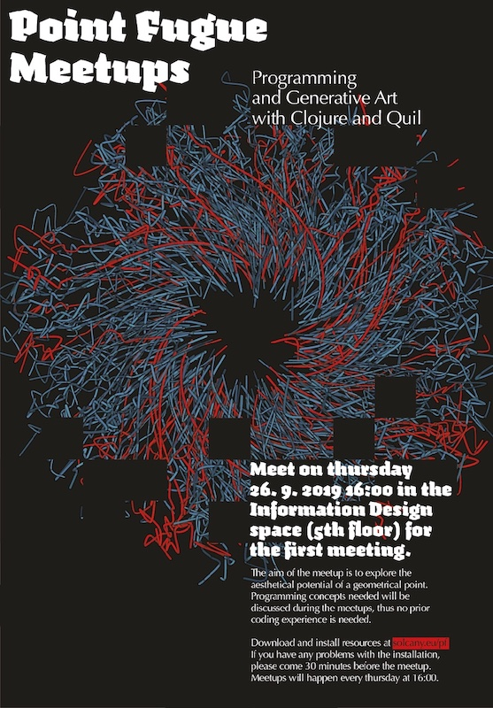

{{}}

Pointfugue Meetups were a trimester long, weekly series of workshops on generative art, animation and sound with Quil and Processing.

## Location
Design Academy Eindhoven, MA Information Design, The Netherlands, 2019

## Tools
Quil, Processing, Clojure, Java
