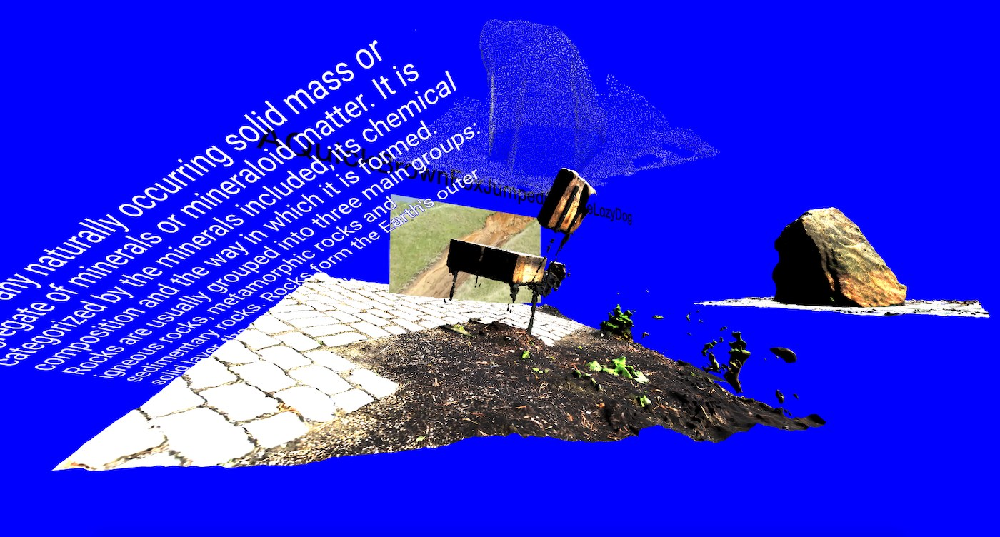

{{}}

During this 3 day workshop the students used photogrammetric 3d scanning technique to 3d scan objects around Eindhoven. Later they assembled their 3d scans together with images, sound and music to create virtual reality bricolages. Some of the virtual spaces the students have created can be explored below.























### Location
Design Academy Eindhoven, MA Information Design, The Netherlands, 2020

### Tools
Camera, Metashape, Aframe, Html, Css, Javascript
