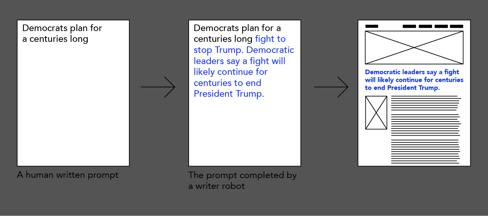

{{}}

This 3 day workshop introduced students to the methods of text generation with Gpt2 language model.

This tool can be used to answer questions, summarise passages of text and generate new passages of text from human written prompts. With sufficient training data a Gpt2 writer robot can be trained to appropriate the writing style and the content of a famous author or conspiracy news writers and synthesise new fan fiction, a poem, fake news article or a conspiracy theory.

During this workshop the students trained their own writer robots with the content from various sources like astrology, personal Whatsapp history, norse mythology or Jane Austen.

The textual training material was obtained from open access sources or scraped from conspiratorial news websites with Scrapy and Python. On the last day of the workshop the students used their robot text writers to deliberate on prompts like: "What should I make for dinner?", "Revolution, for a robot, means..." or "Your Venus is not compatible with mine because...". For example when the astrologer robot was asked what should they make for a dinner they replied: 

“This question is usually asked on the very first day of a wedding, and it is really a bad sign. First, you have got to assess the people and circumstances of the family. Then find out what sort of food you can afford and where you want to eat. If the people are poor, you can probably feed yourself, and if they are well off, you should have plenty of spare money. “ (The Astrologer robot was trained by Emma Theodórsdóttir)

The musings of all the robots were later assembled into a zine by one of the students.

## Location
Design Academy Eindhoven, MA Information Design, The Netherlands, 2021

## Tools
Python, Scrapy, RunwayML, Gpt2

